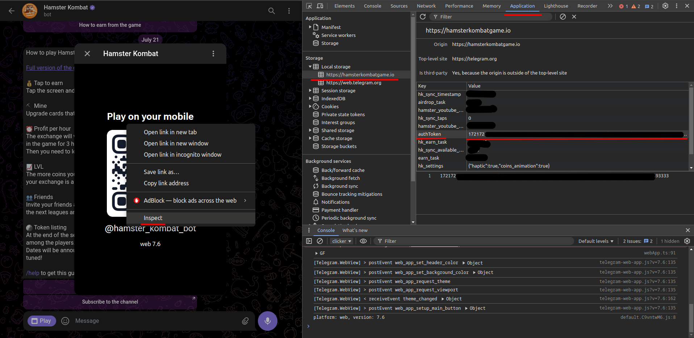

# Бот Hamster Kombat

## Установка

1. **Скачайте проект на локальный компьютер.**
2. **Создайте виртуальное окружение**
```bash
python -m venv .venv
```
и затем активируйте его 
```bash
sh .venv/bin/activate
```
3. **Установите зависимости**
```bash
pip install -r requirements.txt
```
4. **Запутите проект**
```bash
python run.py
```
5. **Добавьте аккаунт**
    - Перейдите Настройки аккаунта -> Добавить аккаунт
    - Заполните необходимые поля

> **ВНИМАНИЕ!**  
> Когда указываете авторизационный ключ в приложении, необходимо добавить приставку `Bearer`  
> Пример: `Bearer 1234567890JbdEjdmdiE...JlDLKCN0987654321`

## Получение вашего авторизационного ключа

1. Перейдите на [web версию Телеграма](https://web.telegram.org/)
2. Войдите в свой Телеграм аккаунт
3. Перейдите в бота [Hamster Kombat](https://web.telegram.org/k/#@hamster_kombat_bot) и запутите игру
4. Нажмите ПКМ в окне, и выберите пункт `Просмотреть`, после чего у вас откроется панель разработчика
5. В панели разработчика сверху выберите пункт `Application` (`Приложение`)
6. В панели Local storage найдите пару с ключом `authToken`, значение этой пары и является вашим ключем (картинка снизу)

